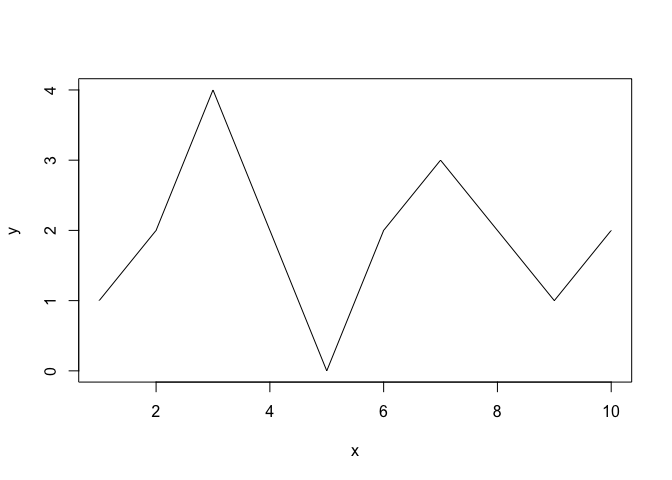
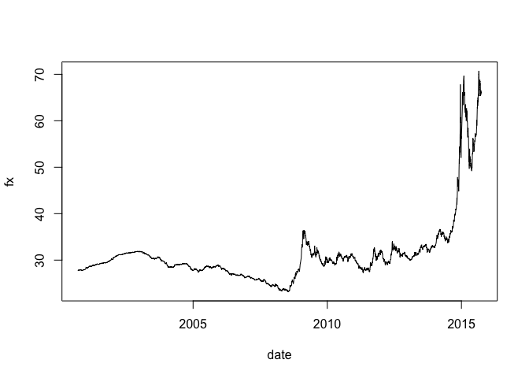
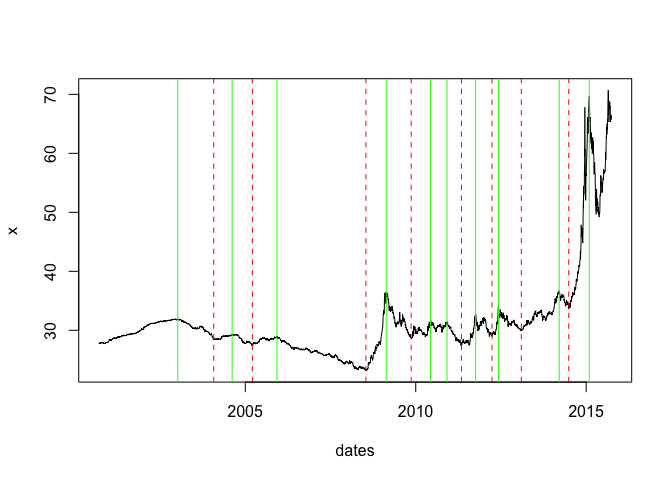

# Задача 4
ЛМ  
28 сентября 2015 г.  
----------------------
*[Главная](http://leonovmx.github.io/info/index.html) --- [Семестр 1](./index.html)*
*Обновлено: 06 октября 2015*
----------------------

# Задача
Необходимо найти локальные максимумы и минимумы при заданном размере окрестности.
Подумать: как можно улучшить определение размера окрестности с учётом разброса значений ряда

Примечание: далее часть кода написана с учётом дат, 
можно всё сделать без этого.

# Пример.


```r
    x <- 1:10
    y <- c(1,2,4,2,0,2,3,2,1,2)
    plot(x, y, type = "l")
```

 

Максимальными значениями являются `c(4, 3)`, минимальными `c(1,0,1)`

# Данные

Данные:

- курс USD относительно рубля.
- с 2000 года по н/в
- столбец 1 - дата, 2 - значений
- формат: csv с точкой запятой
- [скачать тут](./fx.csv)


```r
    x <- read.table(file = "http://leonovmx.github.io/info/s1/fx.csv", header = T, sep = ";")
    x <- read.csv("./fx.csv", sep=";")
    x[,1] <- as.Date(x[,1], format = "%d.%m.%y") # Преобразует даты в понятный формат
    plot(x, type = "l") # Рисует график
```

 

```r
    d <- 100 # Размер окрестности
```

Алгоритм находит точки, которые являются максимумами по определнию.


```
## [1] "Точки максимума и значения:"
```

```
##    точки значения       даты
## 1    576  31.8846 2003-01-09
## 2    975  29.2760 2004-08-13
## 3   1302  28.9978 2005-12-06
## 4   2097  36.4267 2009-02-19
## 5   2419  31.7798 2010-06-08
## 6   2544  31.4555 2010-12-02
## 7   2752  32.6799 2011-10-05
## 8   2915  34.0395 2012-06-05
## 9   3357  36.6505 2014-03-18
## 10  3573  69.6640 2015-02-03
```

```
## [1] "Точки минимума и значения:"
```

```
##   точки значения       даты
## 1   840  28.4850 2004-01-29
## 2  1120  27.4611 2005-03-18
## 3  1948  23.1255 2008-07-16
## 4  2282  28.6701 2009-11-13
## 5  2646  27.2625 2011-05-06
## 6  2868  28.9468 2012-03-28
## 7  3082  29.9251 2013-02-05
## 8  3426  33.6306 2014-06-28
```

Чтобы было наглядно:

```r
plot(x = dates, y = x,  type = "l")
abline(v = dates[vmx], col = "green") # Рисует максимумы
abline(v = dates[vmn], col = "red", lty = 2) # Рисует минимумы
```

 

