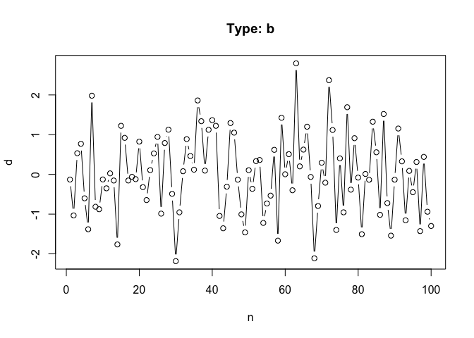
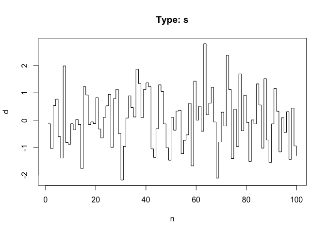

# Рисование графиков. Базовое
LM  
 февраля 2015 г.  
----------------------
*[Главная](http://leonovmx.github.io/info/index.html) --- [Семестр 2](./index/html)*
*Обновлено: 05 апреля 2016*
----------------------

# Графики
## График расеивания 


```r
    n <- 1:100
    d <- rnorm(mean = 0, sd = 1, n = n)
```

Такие команды как `plot`, `hist` создают холст заново, то есть заменяя, если были старые  рисинки. В общем случае рисуется scatter plot (график рассеивания). Каждая точка обозначется кружочком.


```r
plot(x = n, y = d)
```

 

## Различные типы

Если же речь идёт о временных рядах (ценах), то тут важна последовательность.
Лучше соединять точки. Для этого указать надо в параметре `type` значение
`l` или `b`. Тип `s` или `S` - это ступпеньки.


```r
plot(x = n, y = d, type = "l", main = "Type: l")
```

 

```r
plot(x = n, y = d, type = "b", main = "Type: b")
```

 

```r
plot(x = n, y = d, type = "s", main = "Type: s")
```

 

```r
plot(x = n, y = d, type = "S", main = "Type: S")
```

 

## Добавляем подписи
### Название графика

Добавлять параметры можно в функцию `plot` или отдельно, но при этом указывать
в функции `plot`, чтобы они отрисовывались.


```r
plot(x = n, y = d, type = "l", main = "Название графика")
```

 


```r
plot(x = n, y = d, type = "l", main = "")
title(main = "Название графика")
```

 

### Название осей


```r
plot(x = n, y = d, type = "l", main = "Название графика", xlab = "Подпись на оси Х", ylab = "Подпись на оси Y")
```

 


```r
plot(x = n, y = d, type = "l", xlab = "", ylab = "")
title(main = "название графика", 
    xlab = "подпись на оси Х", 
    ylab = "Подпись на оси Y")
```

 

```r
    head(EuStockMarkets)
```

```
##          DAX    SMI    CAC   FTSE
## [1,] 1628.75 1678.1 1772.8 2443.6
## [2,] 1613.63 1688.5 1750.5 2460.2
## [3,] 1606.51 1678.6 1718.0 2448.2
## [4,] 1621.04 1684.1 1708.1 2470.4
## [5,] 1618.16 1686.6 1723.1 2484.7
## [6,] 1610.61 1671.6 1714.3 2466.8
```

```r
    class(EuStockMarkets)
```

```
## [1] "mts"    "ts"     "matrix"
```

```r
    str(EuStockMarkets)
```

```
##  mts [1:1860, 1:4] 1629 1614 1607 1621 1618 ...
##  - attr(*, "dimnames")=List of 2
##   ..$ : NULL
##   ..$ : chr [1:4] "DAX" "SMI" "CAC" "FTSE"
##  - attr(*, "tsp")= num [1:3] 1991 1999 260
##  - attr(*, "class")= chr [1:3] "mts" "ts" "matrix"
```

```r
    dim(EuStockMarkets)
```

```
## [1] 1860    4
```
