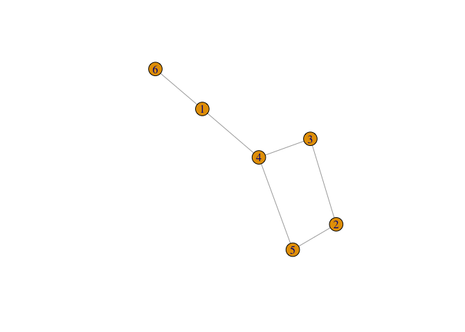

# Графы
LM  
 11 марта 2015 г.  
----------------------
*[Главная](http://leonovmx.github.io/info/index.html) --- [Семестр 2](./index/html)*
*Обновлено: 11 апреля 2016*
----------------------
# Основное 


```r
library(igraph)
```

```
## 
## Attaching package: 'igraph'
## 
## The following objects are masked from 'package:stats':
## 
##     decompose, spectrum
## 
## The following object is masked from 'package:base':
## 
##     union
```

```r
# enter
gr <- matrix(0, ncol = 6, nrow = 6)
gr[1,6] <- gr[6,1] <- 1
gr[1,4] <- gr[4,1] <- 1
gr[4,3] <- gr[3,4] <- 1
gr[4,5] <- gr[5,4] <- 1
gr[2,3] <- gr[3,2] <- 1
gr[5,4] <- gr[4,5] <- 1
gr[5,2] <- gr[2,5] <- 1
g <- igraph::graph.adjacency(adjmatrix=gr, 
                        weighted=NULL,
                        mode = "undirected")
plot(g)
```

 

```r
# levels

main <- 1
n <- nrow(gr)

# 1st level
lvl <- gr[main,]
lvl[lvl == 0] <- -1
lvl[main] <- 0

# other
for(l in 2:(n - 1)){
  for(i in which(lvl == (l - 1))){
    s <- which(gr[i,] == 1)
    s <- s[s %in% which(lvl == -1)]
    lvl[s] <- l
  }
}
```

# Как задать случайный граф


```r
# random
gr <- matrix(data=sample(c(0,1), 
       size=100*100, 
       replace=T, 
       prob=c(0.8,0.2)),
     ncol = 100, nrow = 100)
diag(gr) <- 0
# Сделать симметричным
```
