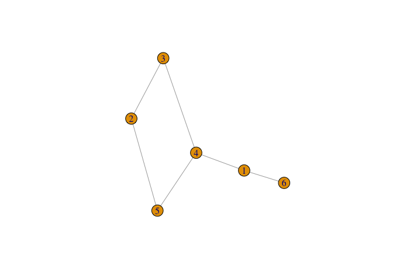
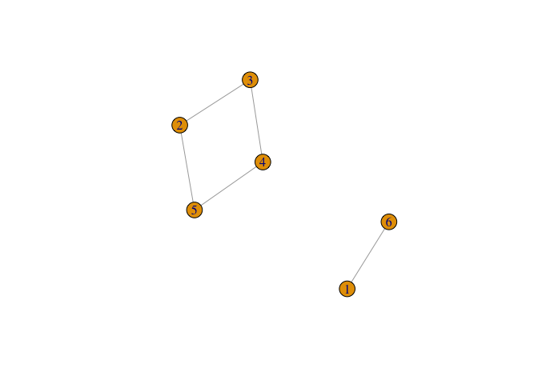

----------------------
*[Главная](http://leonovmx.github.io/info/index.html) --- [Семестр 2](./index/html)*
*Обновлено: 30 March 2019*
----------------------

# Задача

Для случайного графа необходимо сделать следующее:

1. Написать функцию, которая строит матрицу уровней для графа (обход графа в ширину, волновой алгоритм)

[Wiki](https://ru.wikipedia.org/wiki/%D0%90%D0%BB%D0%B3%D0%BE%D1%80%D0%B8%D1%82%D0%BC_%D0%9B%D0%B8)

2. Написать функцию, которая ищет маршрут от вершины v1 до вершины v2
3. Написать функцию, которая возвращает список `list`, каждый элемент которой представляет собой подграф (матрицу)

Если граф связанный, то функция выведет исходную матрицу смежности.
Есть граф состоит из двух подграфов, то лсит будет состоять из 2х матриц.

# Пример 3

# 3.1

Граф связанный

<!-- -->

Функция должна вывести просто


```r
print(result[[1]])
```

```
##      [,1] [,2] [,3] [,4] [,5] [,6]
## [1,]    0    0    0    1    0    1
## [2,]    0    0    1    0    1    0
## [3,]    0    1    0    1    0    0
## [4,]    1    0    1    0    1    0
## [5,]    0    1    0    1    0    0
## [6,]    1    0    0    0    0    0
```

# 3.2

Граф состоит из 2х подграфов

<!-- -->

Функция должна вывести просто


```r
print(result)
```

```
## [[1]]
##   1 6
## 1 0 1
## 6 1 0
## 
## [[2]]
##   2 3 4 5
## 2 0 1 0 1
## 3 1 0 1 0
## 4 0 1 0 1
## 5 1 0 1 0
```

```r
# или

print(result[[1]]) # первый подграф
```

```
##   1 6
## 1 0 1
## 6 1 0
```

```r
print(result[[2]]) # второй подграф
```

```
##   2 3 4 5
## 2 0 1 0 1
## 3 1 0 1 0
## 4 0 1 0 1
## 5 1 0 1 0
```

# 3.3 

Обратите внимание на то, что функция возвращает результат в виде листа.
мы сохранили результат деятельности функции в переменную `result`.


```r
class(result)
```

```
## [1] "list"
```

Чтобы создать лист,


```r
l <- list() # создали пустой лист
l[[1]] <- matrix(sample(1:100, 16), ncol = 4, nrow = 4) # первый элемент листа
l[[2]] <- 1:10 # второй элемент 
l[[3]] <- "wazaaaaaap" # третий элемент 
```

А теперь выводим


```r
l
```

```
## [[1]]
##      [,1] [,2] [,3] [,4]
## [1,]   89   40   43   18
## [2,]    4   68   70   74
## [3,]   21   94   61   86
## [4,]   63   62   99   26
## 
## [[2]]
##  [1]  1  2  3  4  5  6  7  8  9 10
## 
## [[3]]
## [1] "wazaaaaaap"
```
