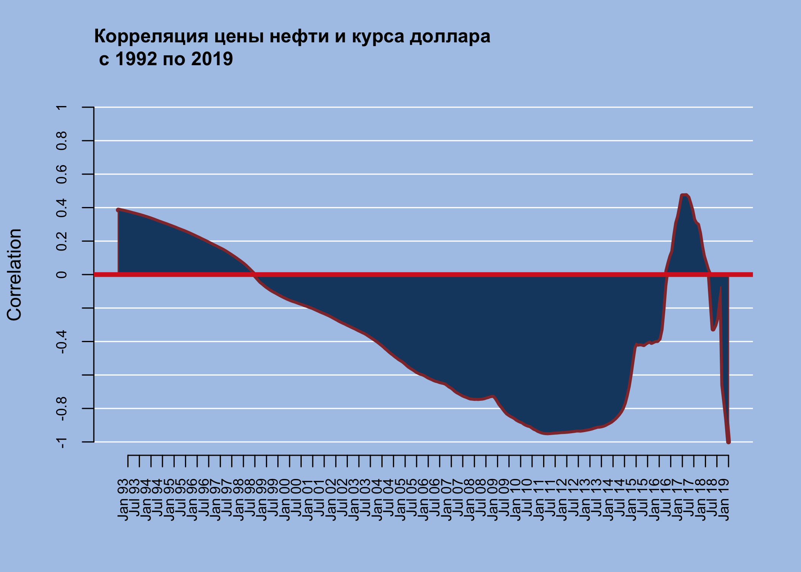

*[Главная](http://leonovmx.github.io/info/index.html) --- [Семестр 2](./index.html)*

*Обновлено: 21 February 2019 16:02*

# Описание

Необходимо загрузить данные, обработать, нарисовать красивые картинки и сделать подписи. 
Существует две таблицы с данными по usd и ценами на brent. 

# Загрузка данных

Данные тут:

- [USD: https://github.com/leonovmx/info/raw/gh-pages/s2/USD.csv](https://github.com/leonovmx/info/raw/gh-pages/s2/USD.csv)
- [brent: https://github.com/leonovmx/info/raw/gh-pages/s2/brent.csv](https://github.com/leonovmx/info/raw/gh-pages/s2/brent.csv)

Чтобы скачать данные, используется функцию 'r read.csv()':


```r
db <- read.csv(
  file = path, # откуда данные
  header = T,  # есть ли заголовки
  sep = ";", # разделитель столбцов
  dec = ",", # разделитель десятичной части
  stringsAsFactors = F # не конвертировать строчки в факторы
) 
```

Помните о функциях, которые позволить посмотреть, что вы загрузили и решить 
возникающие проблемы.


```r
dim(db) # размерность
```

```
## [1] 6050    3
```

```r
nrow(db) # количество строк
```

```
## [1] 6050
```

```r
ncol(db) # количество столбцов
```

```
## [1] 3
```

```r
head(db) # первые 10 строк
```

```
##   nominal       date     curs
## 1       1 01/07/1992 125,2600
## 2       1 03/07/1992 134,8000
## 3       1 08/07/1992 130,5000
## 4       1 10/07/1992 130,3000
## 5       1 15/07/1992 130,2000
## 6       1 17/07/1992 135,4000
```

```r
tail(db) # последние 10 строк
```

```
##      nominal       date    curs
## 6045       1 09/02/2019 66,0628
## 6046       1 12/02/2019 65,6517
## 6047       1 13/02/2019 65,7147
## 6048       1 14/02/2019 65,6783
## 6049       1 15/02/2019 66,5429
## 6050       1 16/02/2019 66,7044
```

```r
str(db) # структура данных 
```

```
## 'data.frame':	6050 obs. of  3 variables:
##  $ nominal: int  1 1 1 1 1 1 1 1 1 1 ...
##  $ date   : chr  "01/07/1992" "03/07/1992" "08/07/1992" "10/07/1992" ...
##  $ curs   : chr  "125,2600" "134,8000" "130,5000" "130,3000" ...
```

Главная функция `str()`, которая позволяет увидеть какой тип у ваших данных:

- num - числовой
- int - целые числа
- chr - текстовый
- logical - логический
- date - дата (не путайте слова data и date)
- может есть другой


Создайте единую БД, которая будет содержать все даты, начиная с первой, 
где есть какая-то информация (или цена нефти, или курс), цена нефти на эту дату и значение курса. 

# Рисование

Нарисовать график динамики цен и сделать подписи. 

<!-- --><!-- -->

# Пропуски


Посчитайте, какое количество дней без данных по курсу доллара в каждом месяце, 
исключив из расчета выходные дни. 


  Год   Месяц   Кол-во
-----  ------  -------
 2000       1        7
 2000       2        4
 2000       3        5
 2000       4        4
 2000       5        9
 2000       6        5


Затем посчитайте, сколько в среднем в каждый месяц дней без данных по курсу c 2000 года.
Нарисуйте bar plot. Какие месяца выходят в топ-3?


<!-- -->

# Агрегирование

Напишите функцию, которая будет агрегировать дневные данные в месячные. На вход:
данные и тип игрегирования:

1. среднее в месяц
2. последнее значение в месяце
3. среднее в месяц только по тем дням, в которые есть значение и по бренту, и по курсу.

```{}
Важно. Для каждого ряда последнее значение в месяце не обязательно в один день. 
```


# Корреляция и коэффициент

Необходимо написать функцию, которая для двух рядов считает корреляции и коээфициент 
при регрессии. Расчёт должен производиться для каждого момента времени: 
если всего $n$ наблюдений, то для наблюдения $t$, $t < n$, считаем корреляцию или 
коэффициент регрессии для наблюдений c $t$ по $n$.


Должна возвращать график динамики изменения коэффицинта регрессии и
коэффициента по времени. Функция должна иметь параметр, который отвечает
за то, рассматриваются ли абсолютные значения или приросты. 

## Корреляция

В идеале корреляция показывает сонаправленность двух величин. Выражается от `-1` до `1`.
Если значение корреляция равно 1, то значит две величины ведут себя одинаково. 
Корреляция двух одинавых рядов даёт 1.

[Wiki: корреляция](https://ru.wikipedia.org/wiki/%D0%9A%D0%BE%D1%80%D1%80%D0%B5%D0%BB%D1%8F%D1%86%D0%B8%D1%8F)

Для двух рядов $X$ и $Y$ расчитывается так:

$$
r_{XY} = \frac{\Sigma_{i=1}^n(x_i-\bar{x})(y_i-\bar{y})}{\sqrt{\Sigma_{i=1}^n(x_i-\bar{x})^2(y_i-\bar{y})^2}}
$$

где 

$$
\bar{x} = \frac{1}{n}\Sigma_{i=1}^nx_i
$$
и аналогично для $\bar{y}$

## Коэффициент регрессии

Представим зависимости в виде $y_i = a + b * x_i$. Где $y$ - курс рубля, $x$ - 
цена нефти, $a$ - константа, $b$ угловой коэффициент. Само собой наши данные не будут лежать 
на одной прямой, но мы можем попытаться подобрать такие параметры $(a, b)$, 
чтобы модель лучшим образом описывала наши данные. 

Это всё называется эконометрикой, вам всё объеснят, но пока мы сосредоточимся на результатах.
Чтобы получить "хорошие" параметры, существует формула:

$$
coef = (X^TX)^{-1}X^TY
$$

где $coef$ вектор, состоящий из двух значений $coef = (a,b)$. 
Эту формулу вам и нужно будет использовать. После получения результата, необходимо 
взять коэффициент $b$ (второй коэффициент).

Все произведения матричные. 
Можете в качестве упражнения проверить, что результат имеет размерность $(2,1)$.

$Y$ - это вектор со значениями курса рубля, имеет размерность $(n - t + 1,1)$.
$X$ - это матрица, содержащая значения цены брента и константу, имеет размерность 
$(n - t + 1,2)$.

$X$ выглядит следующим образом: 

$$
\begin{bmatrix}
    x_{t, 1} & x_{t,2} \\
    x_{t+1,1} & x_{t+1,2} \\
    \dots & \dots \\
    x_{n1} & x_{n2}
\end{bmatrix} = 
\begin{bmatrix}
    1 & oil_t \\
    1 & oil_{t+1} \\
    \dots & \dots \\
    1 & oil_n
\end{bmatrix}
$$

Итого: 

Для каждого значения $t: 1 \leq t < n$

1. Нужно сформировать матрицу $X$, 
2. Расчитать коэффициент $coef = (X^TX)^{-1}X^TY$
3. Взять второй коэффициент
4. Добавить в БД

## Параметры

1. На вход поступают БД в месячной детализации. 
2. Также указывается тип данных, с которыми будет производиться расчеты: абсолютные (0) или приросты (1). 

Приросты расчитываются как 

$$
d = log(brent_i) - log(brent_{i-1})
$$
Это равносильно следующей формуле:

$$
d = \frac{brent_i - brent_{i-1}}{brent_{i-1}}
$$

3. Что делать: корреляция (0) или коэффициент регрессии (1)

## Вывод

Функция рисует график динамики изменения корреляции или коэффициента регрессии, 
а также выводит полученную БД.


```r
q <- fcor(db.last, type = 0, what = 0)
```

<!-- -->

```r
kable(head(q))
```


 year   month   correlation
-----  ------  ------------
 1992       8     0.3856852
 1992       9     0.3831392
 1992      10     0.3805050
 1992      11     0.3778799
 1992      12     0.3751009
 1993       1     0.3722090

# Дополнительно

## merge

Есть стандартная функция для объядинения 2х бд `merge`

```{}
merge(
  x, # таблица 1
  y, # таблица 2
  by = intersect(names(x), names(y)), # указываются имена столбцов, по которым будет производится объединение
  by.x = by, by.y = by, # используются, если столбцы называются не одинаково в разных таблицах
  all = FALSE, all.x = all, all.y = all) # используются, чтобы оставить все элементы из двух таблиц, все элементы пересечения и элементы х и тд 
  
```

## reshape2

`reshape2` - пакет, который позволяет очень быстро и просто делать агрегирование.
В основе 2 главные функции:

- melt - представляет таблицу в формате id, название переменной и значение переменной
- dcast - делает из melt таблицы агрегированную

```
melt{
  data, # - имя таблицы, переменная
  id.vars, # имена столбцов, которые идентифицируют строчку, например c("country","year")
  measure.vars, # название перемнных, которые хочется агрегировать, например c("gdp", "investment")
}
```

```
dcast(
  data, # melt таблица
  formula, # формула в виде country ~ variable, где country - будет id столбец таблицы и для каждого значения country будет посчитано значение переменных
  fun.aggregate = mean # функция агрегирования, mean, sum, sd, length и тд
)

```

## lubridate

`lubridate` - пакет, где есть такие полезные функции как `month`, `year`, `wday`


