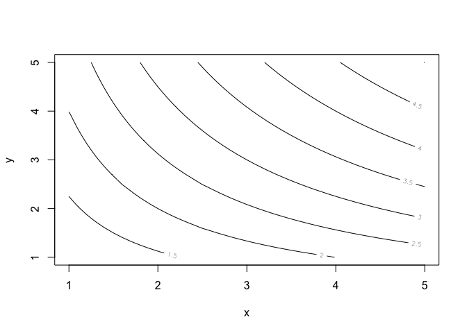
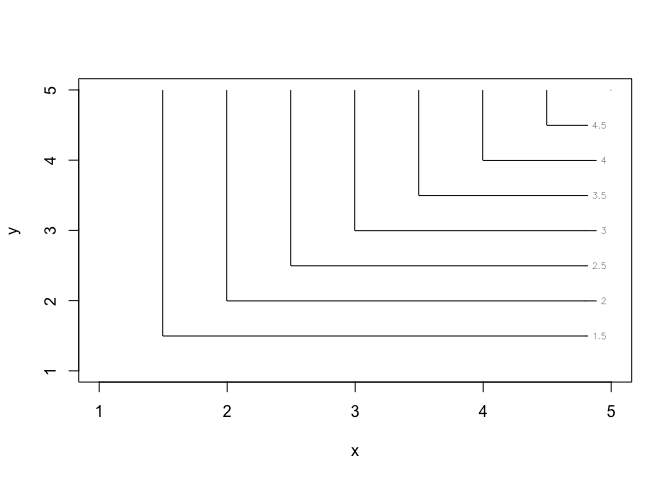

*[Главная](http://leonovmx.github.io/info/index.html) --- [Семестр 2](./index.html)*

*Обновлено: 06 March 2019 01:03*

# Описание

Посередине поля стоит лестница длиной до неба (`n` ступеней). С вероятностью 
`p` на небе ты найдешь сокровище. Каждые `m` шагов появляется великан, бьющий тебя по голове дубинкой, причём с вероятностью `q` ты падаешь на `m/5` ступеней вниз или с `(1-q)` 
остаёшься на месте. 
За каждый сильный удар теряешь `z`% здоровья, за слабый удар - `z/5`% здоровья. 

```{}
Для тех у кого компьютерные игры прошли мимо, если говорится, что теряет 
z% здоровья, то имеется ввиду, что было 100% и вычитается z%. 
Каждый раз после удара нас остается health = health - z, а не health = healt*(1 - z) 

```

# Задача

1. Какова вероятность нахожденяи сокровища, не нахождения сокровища и смерти? 
Построить график динамики вероятности каждого исхода в зависимости от 
количества итераций.

2. Есть параметры n, m, q, z. Построить 4 графики зависимости вероятности 
нахождения сокровища в зависимости от этих параметров. В примечании к графику должно быть
указано значение других параметров.

3. Построить графики, у которых по осям любые два параметра, а линии отображают 
одинаковый уровень вероятностей (Как изокосты или уровни полезности).
В примечании к графику должно быть указано значение других параметров.

# Примечание

Для задачи 3 можно использовать функцию `outer`.


```r
# Пример 1
# задаем функцию от 2х параметров
f <- function(x, y) {
  return(x^(1/2)*y^(1/2))
}

# задаем параметр x и y 
x <- seq(from = 1, to = 5, by = 0.1)
y <- seq(from = 1, to = 5, by = 0.1)

# вычисляем значение функции в каждый точке (x, y), где 
# (x,y) - декартово произведение множеств x и y
z <- outer(X = x, Y = y, FUN = f)

# рисуем
contour(x = x, y = y, z = z, 
        nlevels = 10, # сколько линий показать
        xlab = "x", ylab = "y")
```

<!-- -->

```r
# Пример 2

f <- function(x, y) {
  q <- apply(X = cbind(x,y), MARGIN = 1, FUN = function(e){
    min(c(e[1],e[2]))
  })
  return(q)
}
z <- outer(X = x, Y = y, FUN = f)
contour(x = x, y = y, z = z, nlevels = 10, xlab = "x", ylab = "y")
```

<!-- -->
