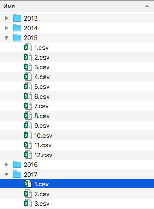
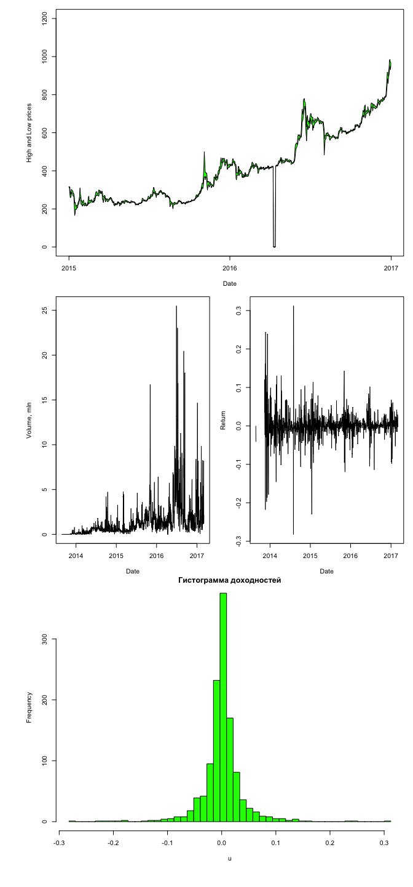

# Оптимизация
LM  
2017-06-03  
----------------------
*[Главная](http://leonovmx.github.io/info/index.html) --- [Семестр 2](./index.html)*
*Обновлено: 06 марта 2017*
----------------------

# Данные
## Cкачать


Перед началом файла не забудьте установить рабочий каталог

```r
setwd("адрес вашей рабочей папки с этой задачей")
```

Скачайте файл из интернета при помощи функции

```r
download.file(url, destfile, method, quiet = FALSE, mode = "w",
              cacheOK = TRUE,
              extra = getOption("download.file.extra"))
```

А данные должны быть тут:
https://github.com/leonovmx/info/raw/gh-pages/s2/data.zip

Описание функции можно найти тут: https://stat.ethz.ch/R-manual/R-devel/library/utils/html/download.file.html

В качестве `destfile` укажите `./какой-то путь/название файла .zip`. 
Разархивируйте файл при помощи следующей команды:

```r
unzip(zipfile, files = NULL, list = FALSE, overwrite = TRUE,
      junkpaths = FALSE, exdir = ".", unzip = "internal",
      setTimes = FALSE)
```

## Структура данных

В файле находятся папки с годами с 2013-2017. В каждой папке находится папка с 
номером месяца. Внутри этих папок файлы с данными.


```r
list.files(path = "/Users/leonovmx/Documents/info/", recursive = T)
```

```
##  [1] "2013/10.csv" "2013/11.csv" "2013/12.csv" "2013/8.csv"  "2013/9.csv" 
##  [6] "2014/1.csv"  "2014/10.csv" "2014/11.csv" "2014/12.csv" "2014/2.csv" 
## [11] "2014/3.csv"  "2014/4.csv"  "2014/5.csv"  "2014/6.csv"  "2014/7.csv" 
## [16] "2014/8.csv"  "2014/9.csv"  "2015/1.csv"  "2015/10.csv" "2015/11.csv"
## [21] "2015/12.csv" "2015/2.csv"  "2015/3.csv"  "2015/4.csv"  "2015/5.csv" 
## [26] "2015/6.csv"  "2015/7.csv"  "2015/8.csv"  "2015/9.csv"  "2016/1.csv" 
## [31] "2016/10.csv" "2016/11.csv" "2016/12.csv" "2016/2.csv"  "2016/3.csv" 
## [36] "2016/4.csv"  "2016/5.csv"  "2016/6.csv"  "2016/7.csv"  "2016/8.csv" 
## [41] "2016/9.csv"  "2017/1.csv"  "2017/2.csv"  "2017/3.csv"  "data.zip"
```



## Загрузка данных

Данные представляют собой обменный курс бикоина с долларом. 


Первые значения и структура одного из файлов.

```r
library(dplyr)
# Базовая функция
str(example)
```

```
## 'data.frame':	31 obs. of  8 variables:
##  $ Open             : num  226 232 236 266 273 ...
##  $ High             : num  232 244 242 268 277 ...
##  $ Low              : num  217 227 222 230 260 ...
##  $ Close            : num  217 227 233 240 266 ...
##  $ Volume..BTC.     : num  2768 1808 2122 5697 4541 ...
##  $ Volume..Currency.: num  629925 418275 496789 1468412 1198203 ...
##  $ Weighted.Price   : num  228 231 234 258 264 ...
##  $ Day              : int  31 30 29 28 27 26 25 24 23 22 ...
```

```r
# Функция из пакета dplyr
dplyr::glimpse(example)
```

```
## Observations: 31
## Variables: 8
## $ Open              <dbl> 226.0100, 232.1600, 236.1600, 265.5700, 273....
## $ High              <dbl> 232.2300, 243.5700, 241.9600, 267.8300, 276....
## $ Low               <dbl> 216.6600, 226.8300, 222.2200, 229.9300, 260....
## $ Close             <dbl> 217.4076, 226.8300, 232.8300, 239.5700, 265....
## $ Volume..BTC.      <dbl> 2768.097, 1808.366, 2121.539, 5696.507, 4540...
## $ Volume..Currency. <dbl> 629925.2, 418274.7, 496788.7, 1468412.5, 119...
## $ Weighted.Price    <dbl> 227.5662, 231.2998, 234.1643, 257.7742, 263....
## $ Day               <int> 31, 30, 29, 28, 27, 26, 25, 24, 23, 22, 21, ...
```

```r
head(example)
```

```
##     Open   High      Low    Close Volume..BTC. Volume..Currency.
## 1 226.01 232.23 216.6600 217.4076     2768.097          629925.2
## 2 232.16 243.57 226.8300 226.8300     1808.366          418274.7
## 3 236.16 241.96 222.2200 232.8300     2121.539          496788.7
## 4 265.57 267.83 229.9300 239.5700     5696.507         1468412.5
## 5 273.25 276.53 260.0000 265.6966     4540.525         1198203.4
## 6 261.87 310.97 261.2129 273.4100     5186.771         1473051.1
##   Weighted.Price Day
## 1       227.5662  31
## 2       231.2998  30
## 3       234.1643  29
## 4       257.7742  28
## 5       263.8909  27
## 6       284.0016  26
```

Загрузите файлы в `R`, объедините файл в один `data.frame`, при этом необходимо 
создать поле `Date`, которая будет содержать значение даты курса.


# Обработка данных

## Заполнение пропусков

Заполните, если есть возможность промежуточные значения при помощи методов
интерполяции. Используйте линейную, экспотенциальную или логорифмическую.
При использовании той или иной интерполяции докажите, что она лучшим образом 
подходит в данном случае.

Для доказательства расчитайте дополнительные точки слева и справа от интервала и 
сравните с истинными значениями.


```
##         Date   Open   High    Low  Close Volume (BTC) Volume (Currency)
## 1 2013-08-25 109.22 111.40 109.22 111.40            2            220.62
## 2 2013-08-26 105.83 105.83 105.83 105.83            1            105.83
## 3 2013-08-27   0.00   0.00   0.00   0.00            0              0.00
## 4 2013-08-28   0.00   0.00   0.00   0.00            0              0.00
## 5 2013-08-29   0.00   0.00   0.00   0.00            0              0.00
## 6 2013-08-30   0.00   0.00   0.00   0.00            0              0.00
##   Weighted Price
## 1         110.31
## 2         105.83
## 3           0.00
## 4           0.00
## 5           0.00
## 6           0.00
```

```
## 'data.frame':	1289 obs. of  8 variables:
##  $ Date             : Date, format: "2013-08-25" "2013-08-26" ...
##  $ Open             : num  109 106 0 0 0 ...
##  $ High             : num  111 106 0 0 0 ...
##  $ Low              : num  109 106 0 0 0 ...
##  $ Close            : num  111 106 0 0 0 ...
##  $ Volume (BTC)     : num  2 1 0 0 0 0 0 0 0 0 ...
##  $ Volume (Currency): num  221 106 0 0 0 ...
##  $ Weighted Price   : num  110 106 0 0 0 ...
##  - attr(*, "freq")= chr "daily"
```

```
## Observations: 1,289
## Variables: 8
## $ Date              <date> 2013-08-25, 2013-08-26, 2013-08-27, 2013-08...
## $ Open              <dbl> 109.22, 105.83, 0.00, 0.00, 0.00, 0.00, 0.00...
## $ High              <dbl> 111.40, 105.83, 0.00, 0.00, 0.00, 0.00, 0.00...
## $ Low               <dbl> 109.22, 105.83, 0.00, 0.00, 0.00, 0.00, 0.00...
## $ Close             <dbl> 111.40, 105.83, 0.00, 0.00, 0.00, 0.00, 0.00...
## $ Volume (BTC)      <dbl> 2, 1, 0, 0, 0, 0, 0, 0, 0, 0, 0, 0, 0, 0, 0,...
## $ Volume (Currency) <dbl> 220.62, 105.83, 0.00, 0.00, 0.00, 0.00, 0.00...
## $ Weighted Price    <dbl> 110.31, 105.83, 0.00, 0.00, 0.00, 0.00, 0.00...
```

## Выгрузка

Необходимо представить данные в следующем виде:


```
## 
## Attaching package: 'tidyr'
```

```
## The following object is masked from 'package:reshape2':
## 
##     smiths
```

```
##    Month      2013     2014     2015     2016      2017
## 1      1        NA 819.4291 249.9547 410.2513  912.5658
## 2      2        NA 636.9579 234.0792 402.3493 1065.8404
## 3      3        NA 592.9285 269.0987 414.6242 1265.4520
## 4      4        NA 461.9577 235.3293 363.6880        NA
## 5      5        NA 482.8881 236.2122 461.0861        NA
## 6      6        NA 617.9270 237.3623 642.8250        NA
## 7      7        NA 615.2700 279.1719 661.8681        NA
## 8      8  31.03286 535.6903 250.7468 579.2058        NA
## 9      9   0.00000 443.4303 233.6323 604.8657        NA
## 10    10   0.00000 361.4936 265.5826 641.7690        NA
## 11    11 465.07953 364.3589 348.8430 725.6217        NA
## 12    12 780.06314 341.0112 424.3674 824.9210        NA
```

И выгрузить в два `.csv` файла, где в одни разделители ";", а в другом ",".


## Нарисуешь в небе солнце, где разбитые мечты

Нарисуйте 3 графика (это должен быть 1 рисунок). 

1) Первый должен содержать минимальное и максимальное значение, область между ними должна быть закрашена в 
жёлтый цвет. 

2) На втором графике отразить динамику объема торгов

3) Динамику изменения цены

4) Гистограмму доходнойстей

<!-- -->

Нарисуйте График типа "Свеча". Постарайтесь, пожалуйста.
Вот пример.

<!--html_preserve--><div id="htmlwidget-58ed63a9a4278d90d71b" style="width:672px;height:480px;" class="dygraphs html-widget"></div>
<script type="application/json" data-for="htmlwidget-58ed63a9a4278d90d71b">{"x":{"attrs":{"labels":["day","Open","High","Low","Close"],"legend":"auto","retainDateWindow":false,"axes":{"x":{"pixelsPerLabel":60}}},"scale":"daily","annotations":[],"shadings":[],"events":[],"format":"date","data":[["2017-02-01T21:00:00.000Z","2017-02-02T21:00:00.000Z","2017-02-03T21:00:00.000Z","2017-02-04T21:00:00.000Z","2017-02-05T21:00:00.000Z","2017-02-06T21:00:00.000Z","2017-02-07T21:00:00.000Z","2017-02-08T21:00:00.000Z","2017-02-09T21:00:00.000Z","2017-02-10T21:00:00.000Z","2017-02-11T21:00:00.000Z","2017-02-12T21:00:00.000Z","2017-02-13T21:00:00.000Z","2017-02-14T21:00:00.000Z","2017-02-15T21:00:00.000Z","2017-02-16T21:00:00.000Z","2017-02-17T21:00:00.000Z","2017-02-18T21:00:00.000Z","2017-02-19T21:00:00.000Z","2017-02-20T21:00:00.000Z","2017-02-21T21:00:00.000Z","2017-02-22T21:00:00.000Z","2017-02-23T21:00:00.000Z","2017-02-24T21:00:00.000Z","2017-02-25T21:00:00.000Z","2017-02-26T21:00:00.000Z","2017-02-27T21:00:00.000Z","2017-02-28T21:00:00.000Z","2017-03-01T21:00:00.000Z","2017-03-02T21:00:00.000Z","2017-03-03T21:00:00.000Z","2017-03-04T21:00:00.000Z"],[988.12,1006.81,1018.29,1032.05,1012.22,1024.36,1052.12,1054.14,990.91,997.22,1009.9,1001.59,1000.66,1012.51,1013.73,1034.42,1057.09,1060.3,1054.56,1082.01,1125.66,1126.52,1187.41,1183.5,1152.61,1181.38,1195.68,1190.48,1226.19,1257.83,1291.39,1268.84],[1011,1025.17,1041.03,1032.05,1035.68,1054.51,1070.94,1079.1,1010,1016.25,1010.16,1008.83,1019.16,1017.16,1038.37,1063.27,1075,1062.83,1087,1128.03,1139.09,1194.29,1215.93,1185.89,1191.5,1198.92,1212.4,1226.16,1283.75,1291.94,1293.55,1284.4],[981.01,995,1005.46,1005.06,1011.23,1024.04,1020.5,943.53,964.71,992.38,999.39,980.51,991.4,1005.13,1012.95,1029.23,1053.7,1046.1,1045.82,1076.68,1102.35,1122.45,1103.98,1127.95,1134.65,1173.26,1179.6,1186.77,1212.48,1255.5,1241.06,1250.56],[1006.97,1017.7,1032.05,1012.67,1024.27,1052.19,1053.9,990.83,997.76,1011.27,1001.92,1000.36,1012.42,1012.91,1034.42,1057.09,1061.07,1054.26,1087,1125.66,1126.7,1178.22,1184.47,1152.2,1181.34,1195.17,1191.19,1226.16,1257.3,1291.39,1269.41,1283]],"plotter":"CandlestickPlotter"},"evals":[],"jsHooks":[]}</script><!--/html_preserve-->

# Анализ
## Модель

Давайте предположим, что модель цены представляет собой следующее:

$$x(t) = a + b_1 * x(t-1) + b_2 * x(t-7) + b_3 * V(t) + b_4*t$$
где x(t) - цена закрытия (или любая другая) в момент $t$, $V(t)$ - объем торгов.

Надо найти такие параметры $a, b_1, b_2, b_3, b_4$, которые бы минимизировали 
значение следующей функции:

$$
f = \Sigma_{i=1}^{N}(x(t) - (a + b_1 * x(t-1) + b_2 * x(t-7) + b_3 * V(t)+ b_4*t))^2
$$
Для этого вам необходимо:
1) подготовить правильно таблицу данных, где каждый столбец отвечает за переменную;
2) Написать функцию, которая зависит от параметров $a, b_1, b_2, b_3, b_4$ и данных и вычисляет необходимое значение функции.
3) примените метод хука-дживса

## Хука дживса

Метод оптимизации для любого числа переменных.
На вход:

1) начальная точка, a0
2) погрешность, e
3) функция, f
4) шаг, d

Как работает:

1) Ищется первая "хорошая" точка вокруг на расстоянии d заданной. Это точка a1.
2) Следующая точка строится по "образцу": в том же направлении на такое же расстояние. Точка a2. Строится до тех, пока функция растет (или уменьшается).
3) Как только не получется найти "хорошей" точки вокруг 

# КАК СДАТЬ

Для того, чтобы сдать, нужно всё оформить в виде RMD файла.
.rmd, .html и все прочие сопутствующие файлы вложить в архив .zip и 
прислать на почту.

Если что-то непонятно, задавайте вопросы!

Если непонятно всё, то выберите что-нибудь и задайте вопрос.

Каждому задавшему хороший вопрос +1 в карму.

Люди с хорошей кармой легче сдают информатику.

Пакеты, которые могут понадобиться

```r
library(xts)
library(dygraphs)
library(Quandl)
library(lubridate)
library(dplyr)
library(reshape2)
library(tidyr)
```


После загрузки и объдинения данных можете проверить их со слдующим `data.frame`


```r
library(xts)
library(dygraphs)
library(Quandl)
library(lubridate)

x <- Quandl("BCHARTS/ITBITUSD")
x <- x %>% 
    arrange(Date)
```
