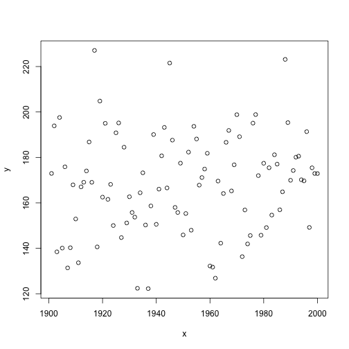
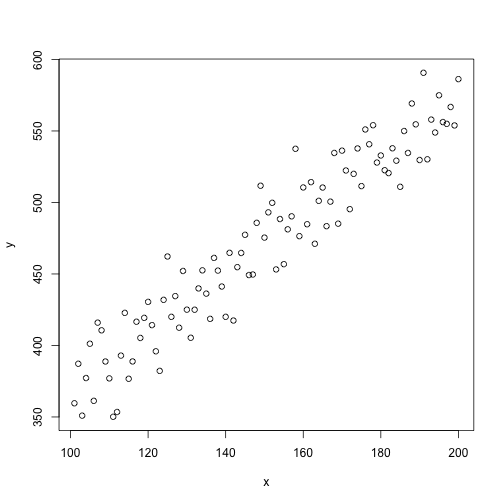
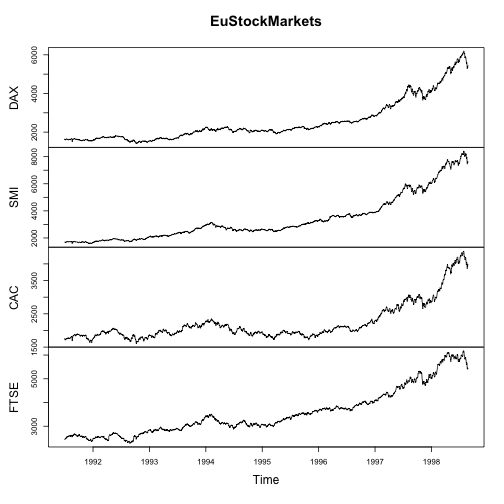

Задача на анализ данных
======================
Имеются данные по 332 датчикам, измеряющим уровень загрязнения в 332 точках США.
Данные по каждому датчику хранятся в отдельном **`.csv`** файле, название которого
является ID датчика. Например, данные датчика №1 хранятся в файле **`001.csv`**.

Данные можно скачать тут: https://yadi.sk/d/nPgfPD0WejLWP

Каждый файл содержит 3 переменные:

- **`Date`**: Дата наблюдения в формате *YYYY-MM-DD*
- **`sulfate`**: уровень содержания сульфатов в воздухе (микрограммы/м^3)
- **`nitrate`**: уровень содержания нитратов в воздухе (микрограммы/м^3)

В данных могут содержаться пропуски значений (NA) для любой переменной.

Необходимо распаковать файл **specdata.zip** в созданную папку **specdata**
Далее задать в качестве рабочей директории папку, содержащую  папку **specdata**
Затем написать три функции.

  1. **`getmonitor`** --- получение данных с конкретного датчика.
  2. **`complete`** --- получение сведений о количестве полных наблюдений для заданного
   списка датчиков.
  3. **`corr`** --- получение вектора корреляций нитратов и сульфатов по всем датчикам
   для заданного порогового значения количества полных наблюдений.

Функция 2 может использовать функцию 1 и не может содержать оператор `complete.cases()`
Функция 3 может использовать функцию 1 и 2

# `getmonitor()`

```r
getmonitor <- function(id, directory, summarize = FALSE) {
    # Тело функции
}
```

#### Аргументы функции
- **`id`** --- вектор (длина=1), обозначающий номер датчика. 
Пользователь может ввести целое число, число, число в виде символа.

- **`directory`** --- символьная переменная длиной 1, обозначающая
место хранения таблиц данных 
  
- **`summarize`** --- логический индикатор. 
По умолчанию "Ложь" - печать не производится
Если "Правда" - производится печать сводной информации

#### Вывод функции 
Функция должна возвращать данные наблюдений конктретного датчика 
в выбранной директории в формате **`data.frame()`**. При необходимости выводить
на экран сводные данные.


**Пример 1.**

```r
data <- getmonitor("1", "specdata")
head(data)
```

```
##         Date sulfate nitrate ID
## 1 2003-01-01      NA      NA  1
## 2 2003-01-02      NA      NA  1
## 3 2003-01-03      NA      NA  1
## 4 2003-01-04      NA      NA  1
## 5 2003-01-05      NA      NA  1
## 6 2003-01-06      NA      NA  1
```
**Пример 2.**

```r
data <- getmonitor(101.00, "specdata", TRUE)
```

```
##          Date        sulfate          nitrate              ID     
##  2005-01-01:  1   Min.   : 1.700   Min.   : 0.2490   Min.   :101  
##  2005-01-02:  1   1st Qu.: 3.062   1st Qu.: 0.6182   1st Qu.:101  
##  2005-01-03:  1   Median : 4.345   Median : 1.0500   Median :101  
##  2005-01-04:  1   Mean   : 6.267   Mean   : 2.2679   Mean   :101  
##  2005-01-05:  1   3rd Qu.: 7.435   3rd Qu.: 2.7825   3rd Qu.:101  
##  2005-01-06:  1   Max.   :22.100   Max.   :10.8000   Max.   :101  
##  (Other)   :724   NA's   :666      NA's   :666
```

```r
head(data)
```

```
##         Date sulfate nitrate  ID
## 1 2005-01-01      NA      NA 101
## 2 2005-01-02      NA      NA 101
## 3 2005-01-03      NA      NA 101
## 4 2005-01-04      NA      NA 101
## 5 2005-01-05      NA      NA 101
## 6 2005-01-06      NA      NA 101
```

# `complete()`


```r
complete <- function(directory, id = 1:332) {
    # тело функции   
}
```

#### Аргументы функции
- **`directory`** --- символьная переменная длиной 1, обозначающая место хранения таблиц данных 
- **`id`** --- целочисленный вектор, обозначающий ID используемых датчиков
  
Требуется найти количество полных наблюдений (без пропущенных, т.е. без `NA`)
в данных для контретногосписка датчиков

#### Вывод функции 
Функция должна возвращать данные в следующем виде (формат `data.frame`):
  

  
**Пример 1.**

```r
complete("specdata", c(2, 4, 8, 10, 12))
```

```
##   id nobs
## 1  2 1041
## 2  4  474
## 3  8  192
## 4 10  148
## 5 12   96
```
**Пример 2.**

```r
complete("specdata", 30:25)
```

```
##   id nobs
## 1 30  932
## 2 29  711
## 3 28  475
## 4 27  338
## 5 26  586
## 6 25  463
```
**Пример 3.**

```r
complete("specdata", 3)
```

```
##   id nobs
## 1  3  243
```

# `corr()`

```r
    corr <- function(directory, threshold = 0) {
        # тело функции   
    }
```
#### Аргументы функции
- **`directory`** --- символьная переменная длиной 1, обозначающая место хранения таблиц данных 
- **`threshold`** --- числовой вектор длиной 1, обозначающий пороговое значение для требуемого количества полных наблюдений, необходимого для расчета корреляции между значениями нитратов и сульфатов. По умолчанию 0.

#### Вывод функции
Функция должна возвращать вектор корреляций значений нитратов и сульфатов для каждого датчика, у которого количество полных наблюдений больше или равно пороговому значению. 


**Пример 1.**

```r
cr <- corr("specdata") 
summary(cr)
```

```
##     Min.  1st Qu.   Median     Mean  3rd Qu.     Max.     NA's 
## -1.00000 -0.05282  0.10720  0.13680  0.27830  1.00000        9
```

```r
length(cr)
```

```
## [1] 332
```
**Пример 2.**

```r
cr <- corr("specdata", 5000)
summary(cr)
```

```
## Length  Class   Mode 
##      0   NULL   NULL
```

```r
length(cr)
```

```
## [1] 0
```

# Статистики, необходимые для выводы в функции getmonitor()

1. Среднее. Вычисляется как арифметическое среднее
2. Медиана.
    - Вычисляется как серединный элемент в отсортированном массиве.
3. Дисперсия, среднеквадратичное отклонение
    - дисперсия $D(x) = \Sigma_{i=1}^n\frac{(x_i - x)^2}{(n-1)}$
    - среднекваратичное отклонение $\sigma(x) = \sqrt{\Sigma_{i=1}^n\frac{(x_i - x)^2}{(n-1)}}$

4. Второй квартиль
    - вычисляется как медиана на интревале до медианы из п. 2
5. Третий квартиль
    - вычисляется как медиана на интревале после медианы из п. 2
6. Минимум
7. Максимум
8. Количество наблюдений, количество NA.

#### Корреляция
Корреляция показывает сонаправленность величин. 
Например, создадим две  величины `x` и `y` и посмотрим на графике как они распределены. Пусть `x` будет упорядочным вектором от `1901` до `2000` (это может быть переменная `Год`), а `y` просто случайная величина (распределённая по нормальному закону).

```r
x <- 1901:2000
y <- rnorm(100, mean = 170, sd = 20)
plot(x, y)
```

 

Никакой закономерности не наблюдается. Корреляция двух величин почти равна `0` (в то время как максимальное значение `1`). 


```r
cor(x = x, y = y)
```

```
## [1] 0.1110058
```

Если же создать `y = x + e`, где `e` - сулчайная величина, то на графике можно увидеть закономерность.


```r
x <- 101:200
y <- 2*x + rnorm(100, mean = 170, sd = 20)
plot(x = x, y = y)
```

 

И корреляция будет "больше", что говорит о том, что величины двигуются "сонаправлено".

```r
cor(x, y)
```

```
## [1] 0.9497727
```

К примеру можно взять более реальные данные. Возьмём дневные данные цен закрытий основных европейских торговых площадок с 1991 по 1998:

- DAX --- Deutscher Aktienindex --- фондовый индекс Германии.
- SMI --- Swiss Market Index --- швейцарский фондовый индекс.
- CAC --- Cotation Assistée en Continu --- фондовым индексом Франции.
- FTSE --- Financial Times Stock Exchange Index --- индекс Британской фондовой биржи.


```r
library("datasets")
cor(EuStockMarkets)
```

```
##            DAX       SMI       CAC      FTSE
## DAX  1.0000000 0.9911539 0.9662274 0.9751778
## SMI  0.9911539 1.0000000 0.9468139 0.9899691
## CAC  0.9662274 0.9468139 1.0000000 0.9157265
## FTSE 0.9751778 0.9899691 0.9157265 1.0000000
```

Корреляция всех индексов близка к `1`, что говорит о сонаправленности всех индексов, их динамика очень схожа друг с другом, что видно на графике ниже. Но важно помнить, что корреляция не коим образом не указывает на причино-следственную связь.


```r
plot(EuStockMarkets)
```

 
