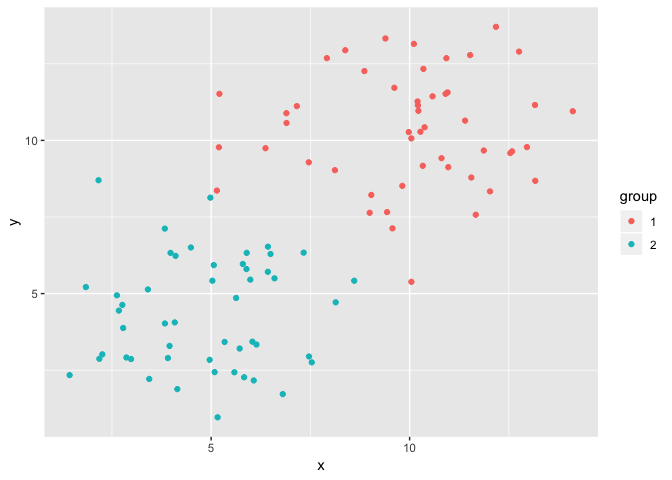

----------------------
*[Главная](http://leonovmx.github.io/info/index.html) --- [Семестр 2](./index/html)*
*Обновлено: 09 May 2019*
----------------------

Документ будет формироваться и немного меняться.

# Задачи
1. Кластеризация банков на последнюю дату. Использовать готовую ф-ю.
2. Динамика доли кредитов и депозитов физиков и юриков 
госбанков и сбербанка (за последние 3-4 года)

# Данные

При выполнении задания рекомендую установить рабочую директорию.
В данной папке у вас должны находится скаченные документы и файлы. 
Это существенно упростит выполнение задания.

```r
  setwd(dir = "~/Documents/GitHub/info/s2/banks_data/")
  # ~  обозначает "домашнюю" папку
```

# Описание
Данные представляют собой балансы банков с 2004 года на каждый месяц по сегодня. 

[Сайт ЦБ РФ](http://cbr.ru/) --- [Информация по кредитным организациям](http://cbr.ru/credit/) --- [Формы отчётности](http://cbr.ru/credit/forms.asp)

Форма 101 --- Оборотная ведомость по счетам бухгалтерского учета
кредитной организации (А, к примеру, форма 102 --- 
отчёт о прибылях и убытках). 
Данная форма составляется на конкретную дату 
(на первое число каждого месяца 
без учета операций в этот день). 
Форма содержит информацию о привлечённых 
депозитах, выданных кредитах, объёмах просроченной задолженности, 
о кредитах, выданных ЦБ этой кредитной организации.

План счетов (список всех счетов и что они значат) можно посмотреть тут:

- [Документ ЦБ с планом счетов](http://www.cbr.ru/analytics/standart_acts/others/302-p.pdf)
- [Консультант + ](http://www.consultant.ru/document/cons_doc_LAW_174901/?frame=1#p71)
- [Google](https://www.google.ru/search?hl=ru&q=%D0%BF%D0%BB%D0%B0%D0%BD+%D1%81%D1%87%D0%B5%D1%82%D0%BE%D0%B2+%D0%B1%D0%B0%D0%BD%D0%BA%D0%B0&btnG=%D0%9F%D0%BE%D0%B8%D1%81%D0%BA+%D0%B2+Google&lr=&gws_rd=ssl)

## Структура

Папка на определенную дату содержит следующие файлы (в зависимости от периода, где-то файлов меньше):

1. mmyyyy_B.DBF - балансы банков
2. mmyyyy_N.DBF - имена банков, которые есть в отчете в п. 1
3. mmyyyy_S.DBF - ненужный файл
4. mmyyyyB1.DBF - балансы банков
5. mmyyyyN1.DBF - имена банков, которые есть в отчете в п. 4
6. mmyyyyS1.DBF - ненужный файл
7. names.DBF - номера и названия счетов, тоже не особо нужен

Файлы, которые имеют "_", отличаются от других просто количеством предоставляемой информации. Если банк есть в одной файле, то его нет в другом.

Описание переменных можно взять тут: 
http://cbr.ru/credit/forms/
http://cbr.ru/vfs/credit/formats/101-20181201.PDF

## Загрузка данных

Скачивайте данные за 2015 - н/в. Берите квартальные данные. 
Для загрузки данных формата `DBF` необходима функция `read.dbf()` из пакета
`foreign`.


```r
  library(foreign)
  d_b <- read.dbf(file = path_to_file, as.is = T)
  head(d_b)
```

```
##   REGN PLAN NUM_SC A_P      VR      VV    VITG      ORA      OVA    OITGA
## 1    1 \x80  10605   1 3072535       0 3072535  8447315        0  8447315
## 2    1 \x80  10610   1 1792729       0 1792729        0        0        0
## 3    1 \x80  20202   1 2631566 4173422 6804988 28307132 11636585 39943717
## 4    1 \x80  20208   1 1826144  480846 2306990 13329907  3437126 16767033
## 5    1 \x80  20209   1  261132  232374  493506  9425625  6541838 15967463
## 6    1 \x80  20308   1       0    4984    4984        0        0        0
##        ORP      OVP    OITGP      IR      IV    IITG         DT PRIZ
## 1  8858366        0  8858366 2661484       0 2661484 2019-01-01    1
## 2        0        0        0 1792729       0 1792729 2019-01-01    1
## 3 27269874 10745349 38015223 3668824 5064658 8733482 2019-01-01    1
## 4 12836601  3267728 16104329 2319450  650244 2969694 2019-01-01    1
## 5  9407410  6665380 16072790  279347  108832  388179 2019-01-01    1
## 6        0       16       16       0    4968    4968 2019-01-01    1
```

```r
# path_to_file - путь к файлу, текстовый тип, вида "./122018B1.DBF"
# параметр as.is = T указывает функции на то, чтобы она текстовые форматы 
# оставляла текстовыми
```

Для получения адреса можно использовать функции `list.dirs` и `list.files`. 

1. `list.dirs(path = , recursive = )` - позволяет получить список всех папок (директорий).
    - параметр `path` указывает, где надо искать папки;
    - если параметр `recursive` указан как `F`, то будут выведены, только папки, 
    которые находят по указаному адресу в `path`, Если параметр указан как `T`, то функция будет искать папки и внутри уже найденных папок.
   
2. `list.files(path = , pattern = , recursive = , ignore.case = )` позволяет найти файлы по заданному адресу. 
    - `path` содержит путь, где надо искать файлы; 
    - в параметре `pattern` указывается шаблон искомых файлов. Например, можно указать "B.DBF$", чтобы он искал только файлы, которые заканчиваются на "B.DBF", а знак $ указывает на то, что это должен быть конец строки (более подробно о таких символах в разделе "Работа с текстом. Регулярные выражения"). 
    - параметр `recursive` указывает, надо ли искать в
имеющихся папках дальше (вглубь). 
    - `ignore.case = T` указывает, что надо игнорировать
регистр (большие и маленькие буквы).


```r
  print(list.files(path = "." , pattern = ".DBF$", recursive = T, ignore.case = T))
```

```
## [1] "banks_data/122018B1.DBF" "banks_data/122018N1.DBF"
## [3] "banks_data/NAMES.DBF"
```

Данными функциями можно воспользоваться, 
чтобы получить список всех папок,
путем сортировки, можно найти 
"последнюю" папку (то есть папку на последнюю 
доступную дату). 

Затем можно получить список файлов, находящихся в папке. 

Данные закодированы в кодировке **866**. 
Для перекодирования необходимо применить к каждому ряду, который
является текстовым типом, функцию `iconv(x, from = "866")`. `x` - что будет 
перекодировано, `from = "866"` - из какой кодировки.

Чтобы определить тип столбца, можно вопсользоваться функцией `class`.


```r
x <- data.frame(n = c(1,2,3,4), 
                t = as.character(c(1,2,3,4)), 
                tt = c("Москва", "Питер", "Волгоград", "Севастополь"),
                stringsAsFactors = F)
sapply(X = x, FUN = class)
```

```
##           n           t          tt 
##   "numeric" "character" "character"
```

```r
sapply(X = x, FUN = class) == "character"
```

```
##     n     t    tt 
## FALSE  TRUE  TRUE
```

# Кластеризация

Загрузив данные на последнюю доступную дату необходимо провести 
кластеризацию банков. Для начала необходимо выбрать параметры, по которым 
будут сраниваться банки. Например: размер активов, доля депозитов ФЛ в активах,
отношение депозитов к кредитам.

Провести кластеризацию модифицрованным методом K-means. В рамках кластеризации 
определить не только принадлежность каждого банка к кластеру, но и 
определить количество кластеров.

Если выбраны номинальные показатели (размер активов, депозитов), то для уменьшения
разброса можно использовать `log(), log10()` (возможно такое, что у банка нет какого-то показателя, тогда после применения функции будет получен ответ `-Inf`). 

Если выбран показатель номинальный и доля (размер активов и доля депозитов 
относительно активов), то необходимо привести их более сравнивым показателям, то есть 
номинальыйн показатель также привести к интервалу $[0, 1]$. 

Нормировка показателя $x$ к интервалу $[a, b]$ можно сделать по формуле:
$$x_{new} = \frac{x - x_{min}}{x_{max} - x_{min}} * (b - a) + a$$

## Метод K-means

Всё описано тут.
будут вопросы - спрашиайте.

https://ru.wikipedia.org/wiki/K-means
http://intellect-tver.ru/?p=265
http://www.cs.cmu.edu/~dpelleg/kmeans.html

Пакет R:
https://stat.ethz.ch/R-manual/R-devel/library/stats/html/kmeans.html

### Количество центров

1. Нариуйте просто все точки на графике. Посмотрите, есть ли какие-то явные центры, выеляются ли они. 

2. Выбери в качестве начального количества значение, выбранное в п.1. Увеличьте, уменьшьте количество центров, посмотрите, меняется ли распределение сильно. 


## Отрисовка

Проще всего отрисовать при поиощи пакета `ggplot2`.


```r
library(ggplot2)
x1 <- rnorm(n = 50, mean = 10, sd = 2)
y1 <- rnorm(n = 50, mean = 10, sd = 2)

x2 <- rnorm(n = 50, mean = 5, sd = 2)
y2 <- rnorm(n = 50, mean = 5, sd = 2)

db <- data.frame(x = c(x1,x2), 
                 y = c(y1, y2),
                 group = as.factor(rep(c(1,2), each = 50)))

qplot(x, y, data = db, colour = group)
```

<!-- -->

# Динамика доли государственных банков

Государственные банки - это банки, котрыми владеет государство, государственные
компании, или госудасртвенные банки. Понятие владение означает наличие доли у
владеющей компании не менее 50% акций + 1.


```r
#REGN банков, которые можно назвать госудасртвенными
gos <- c(1481, 1623, 1000, 2168, 650, 2748, 3349, 354, 2403, 2790, 1088, 3360,
         3340, 3466, 1950, 2312, 1911, 1942, 1470, 3287, 843, 2590, 708, 2306, 
         2546)
sber <- 1481
```

Необходимо собрать информацию по депозитам и кредитам в разрезе ФЛ и ЮЛ.
Найти общий объем показателей, найти объём, которые принадлежит госбанкам и отдельно Сберу.
Найти доли на каждую дату. 

нарисовать 4 графика:
1) депозиты физиков 
2) депозиты юриков
3) кредиты физиков
4) кредиты юриков

Подписать доли, название графика, откуда данные.

Тут будет пример графика.

# Что должно быть в отчёте.

Отчет должен быть написан в Rmd. 
Коды не скрывать, вывод не скрывать.
Должно быть описание того:

- какие показатели выбраны и почему
- какое количество центро выбрано и почему
- первая кластеризация, окончательная, с отрисовками
- какой итог, получилось ли выделить какие-то группы
- какая динамика показателей, у кого доля растёт, у кого падает, почему?
- графики

# Приложение.

## Работа с текстом. Регулярные выражения.

Под регулярными выражениями понимаются выражения для работы с текстом. 
Иногда необходимо искать некие шаблоны (чтобы имя файлы было особенным, 
или начиналось с определённого символа) и тд.

Функции для работы с текстом:

1. `grep`, `grepl` - поиск (первая выдает позиции, вторая выдает T/F)
     - `pattern` - что искать (тут как раз и испоьзуются регулярные выражения).
     - `x` - где искать (вектор, где каждый элемент, например, название файла)
2. gsub - замена
     - `pattern` - что искать
     - `replacement` - на что заменять
     - `x` - где искать
     
Пример.
Если необходимо найти картинки (с раширением `png`).
```
# x - список всех имен файлов какой-то папке.
    grep(pattern = "\\.png$", x = x, ignore.case = T)
```

`\\.` - означает просто `.`, но просто нельзя указать, так как точка является
вспомогательным выражением (означает 1 любой символ), потому перед ней стоит `\\`.

`$` означает, что это в конце строки. `^` означает начало строки.

Подробно можно это посмотреть:

1. [Внизу таблица нужная](http://www.endmemo.com/program/R/grep.php)
2. [Инструкция из R](https://stat.ethz.ch/R-manual/R-devel/library/base/html/regex.html)
3. [Wiki](http://en.wikibooks.org/wiki/R_Programming/Text_Processing)
4. [Интересные примеры](http://www.r-bloggers.com/regular-expressions-in-r-vs-rstudio/)

## R MarkDown

MarkDown - упрощённый язык для вёрстки (разметки) текста. 

1. [Wiki + примеры](https://ru.wikipedia.org/wiki/Markdown)
2. [Сайт разработчика + синтаксис](http://daringfireball.net/projects/markdown/syntax)
3. [Github + примеры](https://github.com/adam-p/markdown-here/wiki/Markdown-Cheatsheet)
4. [GitHub + ещё примеры](https://help.github.com/articles/markdown-basics/)
5. [Гайд. Сразу сюда](https://guides.github.com/features/mastering-markdown/)

На основе MarkDown был сделан RMD. 

1. [Главный сайт](http://rmarkdown.rstudio.com)
    - [Основы](http://rmarkdown.rstudio.com/authoring_basics.html)
    
Примеры. 
```
# Заголовок 1
## Заголовок 1.1

Это просто текст, а это *курсив*, а это **жирный**
Чтобы вставить код R, надо использоваться "`" 3 раза и затем {r}.

Чтобы вставить формулу надо использоваться $$formula$$. Между двойными знаками $
используется синтаксис LaTex.
```

Примеры формул $\LaTeX$ можно глянуть тут:
[sharelatex](https://ru.sharelatex.com/learn/Mathematical_expressions)
